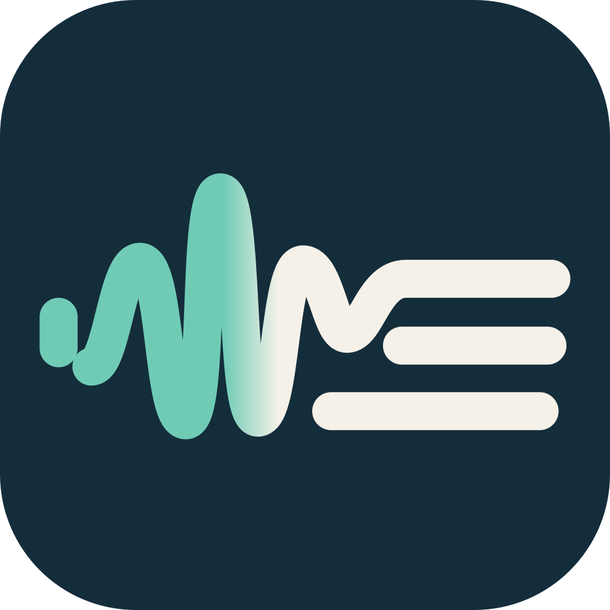
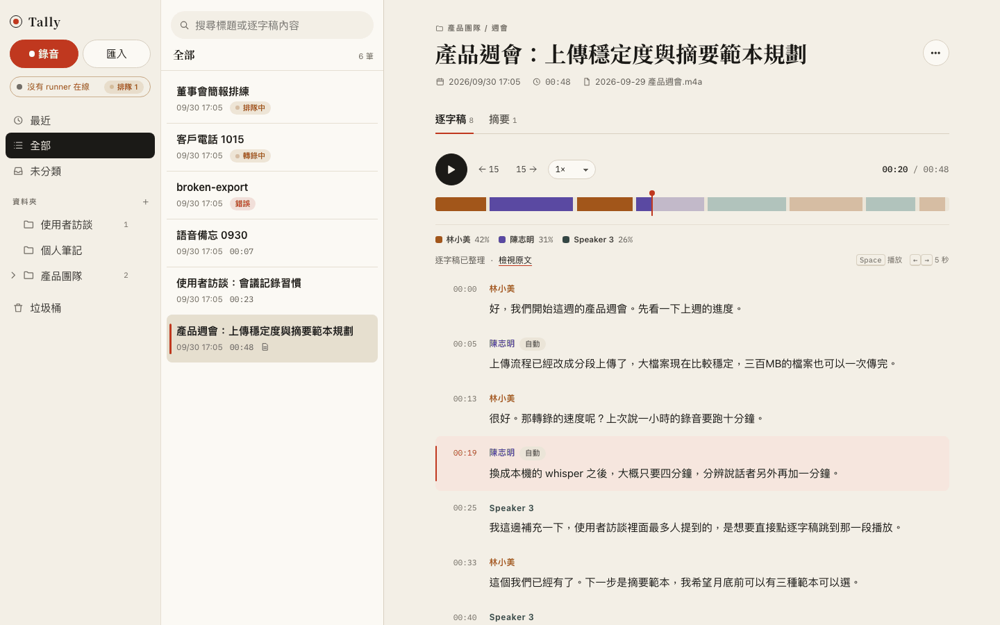

<p align="center"></p>

<h1 align="center">Tally</h1>

<p align="center">Self-hosted AI voice notes: record or import audio, get a speaker-labelled transcript you can play back in sync, and template-based summaries.<br>自架的 AI 語音筆記：錄音或匯入音訊，轉成分講者、可同步播放的逐字稿，再產生摘要。</p>

<picture>
  <source media="(prefers-color-scheme: dark)" srcset="docs/images/screenshot-dark.png">
  
</picture>

## Features

- **Import anything** — drag in many audio/video files at once, or record in the browser (phone too). Large files upload in parallel parts with retries.
- **Transcripts with speakers** — local `whisper.cpp` (Metal) or Groq Whisper, plus `sherpa-onnx` speaker diarization.
- **Synced playback** — click any line to play from there; the seek bar shows who speaks when.
- **Name speakers once** — rename a speaker for one segment or all of them; voiceprints recognise the same person in later recordings.
- **Summaries** — template + language, generated by a local agent over ACP (Claude by default).
- **Folders, search, trash**, a URL for every view, light/dark, works down to 360 px.

## How it works

```
 browser ──▶ Cloudflare Worker (web/) ──▶ D1 (metadata) + R2 (audio)
                     ▲   behind Cloudflare Access
                     │ job queue with leases
 Mac runner (runner/) ─ ffmpeg · whisper-cli · sherpa-onnx · ACP agent
```

- `web/` — Cloudflare Worker in TypeScript, no framework. API, static UI (`web/public/index.html`), D1 migrations.
- `runner/` — Go binary on one or more Apple Silicon Macs. Claims jobs from the Worker, does the heavy lifting locally, pushes results back. Several runners can share the queue.

Audio is stored in your own Cloudflare account and transcribed on your Mac (unless you pick Groq). Transcript clean-up, titles and summaries send the transcript text to whichever model your ACP agent uses.

## Setup

Requirements: a Cloudflare account (Workers Paid for D1/R2 limits), an Apple Silicon Mac with `ffmpeg`, `whisper-cpp`, Go 1.26.

The step-by-step guide (Cloudflare Access, D1/R2, service tokens, runner as a launchd service, phone use) is in [`docs/SETUP.md`](docs/SETUP.md) (Traditional Chinese). Short version:

```sh
# Worker
cd web && npm install
npx wrangler d1 migrations apply noteapp --remote
npx wrangler deploy            # edit wrangler.jsonc first: domain, ACCESS_TEAM, ACCESS_AUD, D1 id

# Runner
cd runner && cp .env.example .env   # API_BASE + Access service token
go run . models                     # downloads whisper + diarization models
go run .                            # start claiming jobs
```

Local development: see [`CLAUDE.md`](CLAUDE.md). Design and API contracts: [`docs/SPEC.md`](docs/SPEC.md).

## Security

The Worker fails closed: without `ACCESS_TEAM` / `ACCESS_AUD` every API call returns 503, and each request's Cloudflare Access JWT is verified. It is built as a single-user tool; there are no per-user accounts.

## License

[MIT](LICENSE)
